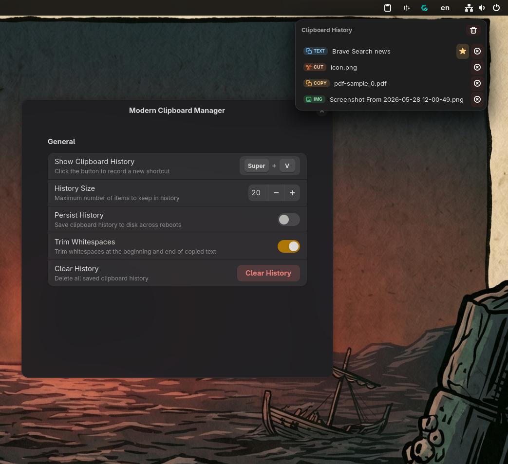

# Modern Clipboard Manager

> Never lose copied text again! A sleek, elegant clipboard manager for GNOME Shell that saves your history even after a reboot.



## ✨ Features

- **Persistent History**: Saves your clipboard history across reboots.
- **Customizable Shortcuts**: Easily accessible via customizable keyboard shortcuts.
- **Adjustable History Size**: Choose exactly how many items you want to keep.
- **Whitespace Trimming**: Automatically trims whitespace from copied text for cleaner pasting.
- **Modern UI**: A beautiful, native-feeling interface that perfectly blends into the GNOME Shell environment.

## 🚀 Installation

### Requirements

GNOME Shell version **45, 46, 47, 48, 49, or 50**.

### Method 1: GNOME Extensions Store

*(Pending publication - Coming soon!)*

### Method 2: Manual Installation

1. Clone this repository or download the source code:
   ```bash
   git clone https://github.com/nadeem-elbarbari/modern-clipboard.git ~/.local/share/gnome-shell/extensions/modern-clipboard@nadeem-elbarbari.github.com
   ```

2. Compile the glib schemas:
   ```bash
   glib-compile-schemas ~/.local/share/gnome-shell/extensions/modern-clipboard@nadeem-elbarbari.github.com/schemas
   ```

3. Restart GNOME Shell:
   - On X11: Press `Alt+F2`, type `r`, and press `Enter`.
   - On Wayland: Log out and log back in.

4. Enable the extension using the "Extensions" app or via terminal:
   ```bash
   gnome-extensions enable modern-clipboard@nadeem-elbarbari.github.com
   ```

## ⚙️ Configuration

You can access the settings for Modern Clipboard Manager through the GNOME Extensions app. From there, you can:
- Configure your preferred keyboard shortcut.
- Adjust the maximum number of history items to keep.
- Toggle automatic whitespace trimming.

## 🤝 Contributing

Contributions, issues, and feature requests are welcome! Feel free to check the issues page if you want to contribute.

## 📝 License

This project is licensed under the terms of the license included in this repository.
